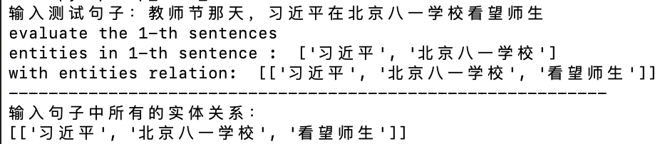
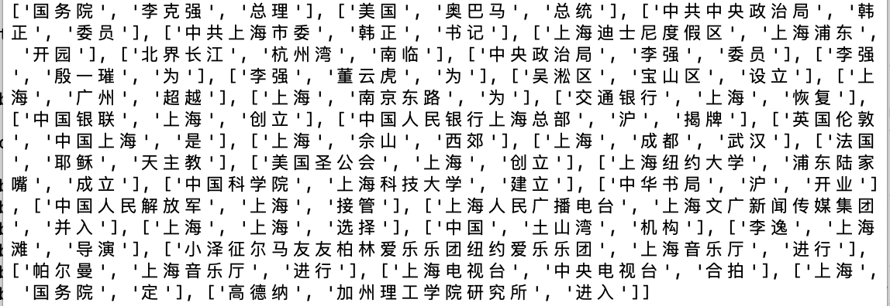

# Chinese-relation-extraction

This code is based on the paper: [Chinese Open Relation Extraction and Knowledge Base Establishment](https://www.researchgate.net/publication/323198509_Chinese_Open_Relation_Extraction_and_Knowledge_Base_Establishment)

由于中文数据太少，一些监督学习方法往往没有足够的数据来进行训练。

这篇论文利用一些语法分析规则和实体识别结果进行实体间关系的抽取。

**命名实体识别**以及**句法分析**选择直接使用 [pyltp库](https://github.com/HIT-SCIR/pyltp)

具体实体标注形式和句法关系见：（https://ltp.readthedocs.io/zh_CN/latest/appendix.html）

# 依赖

- python3

- [pyltp](https://github.com/HIT-SCIR/pyltp)


# 运行

```relation_extraction.py```： 包含七种不同的语法分析，能够根据句子来进行匹配，再依此生成关系三元组。

```utils.py```: 包含从文件中读取数据以及数据预处理的函数。

```test.py```: 运行示例。

- 读取键盘输入并进行关系抽取：

```
python3 relation_extraction.py path_to_your_model
```

- 抽取一个中文维基百科的json文件，默认为当前目录下的 ```wiki_00``` 文件：

```
python3 test.py path_to_your_model --file[optional] path_to_your_file
```

所有中文维基百科语料库json版下载地址：

<a href='https://storage.googleapis.com/nlp_chinese_corpus/wiki_zh_2019.zip'>点此直接下载</a>

# 实验结果

- 读取键盘输入：

<div align="center">

</div>

- 抽取```wiki_00```文件中的实体关系：

<div align="center">

</div>


